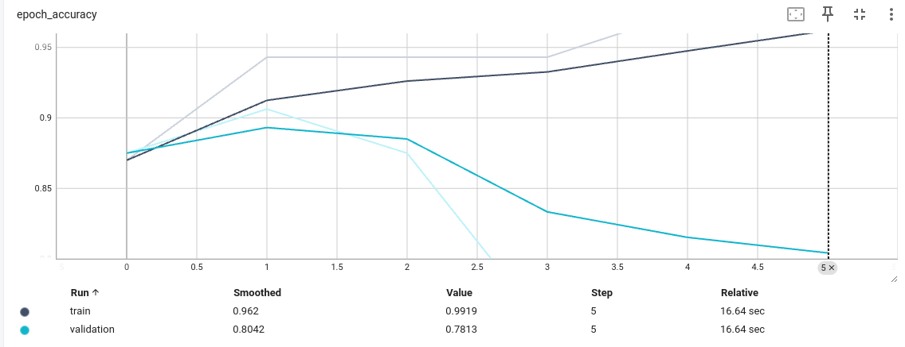

# Table of Contents

- [Table of Contents](#table-of-contents)
- [Introduction](#introduction)
  - [Project Overview](#project-overview)
  - [Purpose](#purpose)
- [Getting Started](#getting-started)
  - [Installation](#installation)
    - [Prerequisites](#prerequisites)
    - [Clone the Repository](#clone-the-repository)
    - [Create Virtual Environment (Optional)](#create-virtual-environment-optional)
    - [Install Dependencies](#install-dependencies)
  - [Project Structure](#project-structure)
  - [Dependencies](#dependencies)
- [Data preparation](#data-preparation)
  - [Data Collection](#data-collection)
    - [Data Exploration:](#data-exploration)
  - [Data Augmentation](#data-augmentation)
- [Exploratory Data Analysis (EDA)](#exploratory-data-analysis-eda)
    - [Sample Images](#sample-images)
    - [Class Distribution](#class-distribution)
- [Model Development](#model-development)
  - [Model Architecture](#model-architecture)
  - [Training](#training)
  - [Fine-Tuning](#fine-tuning)
- [Results](#results)
  - [Prediction Examples](#prediction-examples)
  - [Model Performance](#model-performance)
    - [Original Model Performance](#original-model-performance)
      - [Training and Validation Accuracy](#training-and-validation-accuracy)
      - [Training and Validation Loss](#training-and-validation-loss)
    - [Fine-Tuned Model Performance](#fine-tuned-model-performance)
      - [Training and Validation Accuracy After Fine-Tuning](#training-and-validation-accuracy-after-fine-tuning)
      - [Training and Validation Loss After Fine-Tuning](#training-and-validation-loss-after-fine-tuning)
  - [Model Comparison](#model-comparison)

<a id="introduction"></a>

# Introduction

## Project Overview
This project is to develop a deep learning model that can classify products from images into three categories: stationary, accessories, or fashion. The model will be trained on a dataset of labeled images and will use convolutional neural networks (CNNs) to extract features and make accurate predictions.


## Purpose

The purpose of this project is to provide a solution for automating the classification of products based on their images. This can be useful in various applications such as e-commerce platforms, inventory management systems, and visual search engines. By accurately classifying products, businesses can improve their efficiency, enhance user experience, and make better data-driven decisions.

# Getting Started

## Installation

To get started with this project, follow the steps below for a seamless installation of dependencies.

### Prerequisites

Make sure you have the following installed on your system:

- [Python](https://www.python.org/) (>=3.6)
- [virtualenv](https://virtualenv.pypa.io/) (for creating isolated Python environments) (Optional)

### Clone the Repository

```bash
git clone https://github.com/MohamedSamir245/Product_classification_slash
cd your_project
```

### Create Virtual Environment (Optional)

```
# Create a virtual environment
virtualenv venv

# Activate the virtual environment
# On Windows
.\venv\Scripts\activate
# On macOS/Linux
source venv/bin/activate
```

### Install Dependencies

```
make requirements
```

## Project Structure

    base
    |
    ├── Makefile           <- Makefile with commands like `make data` or `make train`
    ├── README.md          <- The top-level README for developers using this project.
    ├── data
    │   ├── external       <- Data from third party sources.
    │   └── raw            <- The original, immutable data dump.
    │
    │
    ├── models             <- Trained and serialized models, model checkpoints, or model summaries
    │
    ├── notebooks         
    │
    ├── reports            <- Generated analysis as HTML, PDF, LaTeX, etc.
    │   └── figures        <- Generated graphics and figures to be used in reporting
    │
    ├── requirements.txt   <- The requirements file for reproducing the analysis environment, e.g.
    │                         generated with `pip freeze > requirements.txt`
    │
    ├── setup.py           <- makes project pip installable (pip install -e .) so src can be imported
    ├── src                <- Source code for use in this project.
    │   ├── __init__.py    <- Makes src a Python module
    │   │
    │   ├── data           <- Scripts to download or generate data
    │   │   ├── explore.py
    │   │   └── functions.py
    │   └── models         <- Scripts to train models and then use trained models to make
    │       │  
    |       ├── functions.py
    │       └── train_model.py
    │   
    │
    └── tox.ini            <- tox file with settings for running tox; see tox.readthedocs.io

## Dependencies

The following dependencies are required to run this project. Make sure to install them before getting started:

- [darkdetect](https://pypi.org/project/darkdetect/)==0.8.0
- [keras_preprocessing](https://pypi.org/project/keras-preprocessing/)==1.1.2
- [PyGObject](https://pypi.org/project/PyGObject/)==3.42.1
- [pytest](https://pypi.org/project/pytest/)==7.4.4
- [scikit-learn](https://pypi.org/project/scikit-learn/)==1.4.0
- [seaborn](https://pypi.org/project/seaborn/)==0.13.1
- [setuptools](https://pypi.org/project/setuptools/)==68.2.2
- [tkinterDnD](https://pypi.org/project/tkinterDnD/)==0.0.0
- [traitlets](https://pypi.org/project/traitlets/)==5.14.1
- [typing-extensions](https://pypi.org/project/typing-extensions/)==4.9.0
- [customtkinter](https://pypi.org/project/customtkinter/)==5.2.2
- [tensorflow](https://pypi.org/project/tensorflow/)==2.15.0
- [Pillow](https://pypi.org/project/Pillow/)==10.2.0
- [opencv-python](https://pypi.org/project/opencv-python/)==4.9.0.80


# Data preparation

## Data Collection
Dataset was collceted by taking screen shots of the products from the website and then labeling them into three categories: stationary, accessories, or fashion. The dataset was then split into training, validation, and test sets to facilitate model development and evaluation.


### Data Exploration:

Before diving into the model development, a thorough exploration of the dataset was conducted to understand its structure, the distribution of bird species, and potential challenges. Exploratory Data Analysis (EDA) insights can be found in the [Exploratory Data Analysis](#exploratory-data-analysis) section.

## Data Augmentation

To enhance the model's generalization capabilities and mitigate overfitting, data augmentation techniques were applied to the training dataset. The following transformations were incorporated into the data augmentation pipeline:

```python
data_augmentation = tf.keras.Sequential([
    tf.keras.layers.RandomFlip(mode="horizontal", seed=42),
    tf.keras.layers.RandomRotation(factor=0.05, seed=42),
    tf.keras.layers.RandomZoom(0.05, seed=42),
])
```

# Exploratory Data Analysis (EDA)

### Sample Images

Below are sample images from the dataset, providing a visual representation of the input data:


### Class Distribution

To understand the class distribution and assess the balance of the dataset, the distribution of the labels is visualized in the figure below:


# Model Development

since the dataset is small, I used transfer learning to build the model. I used the Inception_V3 model as the base model and added a few layers on top of it to make it suitable for the classification task.

## Model Architecture

The core architecture of the model is based on the Inception_V3 neural network, a powerful convolutional neural network (CNN) commonly used for image classification tasks. Below is an overview of the architecture:

```plaintext
    Model: "sequential_1"
_________________________________________________________________
 Layer (type)                Output Shape              Param #
=================================================================
 sequential (Sequential)     (None, 224, 224, 3)       0

 inception_v3 (Functional)   (None, None, None, 2048)  21802784

 global_average_pooling_laye  (None, 2048)             0
 r (GlobalAveragePooling2D)

 output-layer (Dense)        (None, 525)               1075725

=================================================================
Total params: 22,878,509
Trainable params: 1,075,725
Non-trainable params: 21,802,784
_________________________________________________________________
```

## Training

The model underwent an initial training phase using the provided dataset. The training process incorporated several key aspects to ensure optimal model performance:

- **Data Augmentation:** To boost the model's generalization capabilities, various data augmentation techniques were applied during the training phase.

- **Checkpoint:** A checkpoint callback was implemented to save the best model configuration after the completion of each training epoch.

- **Early Stopping:** A mechanism was in place to terminate the training process if there was no improvement in the validation loss over a specified number of epochs.

- **Reduced Learning Rate on Plateau:** The learning rate dynamically adjusted downwards if the validation loss reached a plateau, enhancing convergence.

- **TensorBoard:** The TensorBoard callback played a crucial role in visualizing and monitoring the training process, providing valuable insights into model behavior and performance.

## Fine-Tuning

To further enhance the model's performance, the top 22 layers of the Inception_V3 model were fine-tuned. This process involved adjusting the weights of these layers based on the specific requirements of the project.

# Results

## Prediction Examples


## Model Performance

### Original Model Performance

#### Training and Validation Accuracy



since the dataset is small, the model overfits the training data, so I used fine-tuning to improve the model's performance.

#### Training and Validation Loss


### Fine-Tuned Model Performance

#### Training and Validation Accuracy After Fine-Tuning


#### Training and Validation Loss After Fine-Tuning


## Model Comparison

Comparing the performance of the original model and the fine-tuned model reveals insights into the effectiveness of the fine-tuning process. The figures above depict the accuracies and losses for both models over epochs, providing a visual representation of their respective performances.

